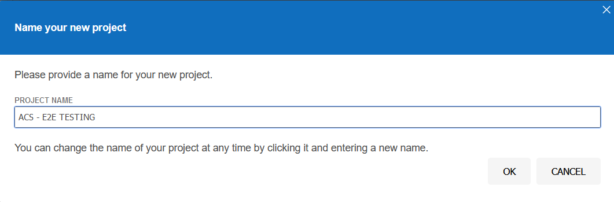
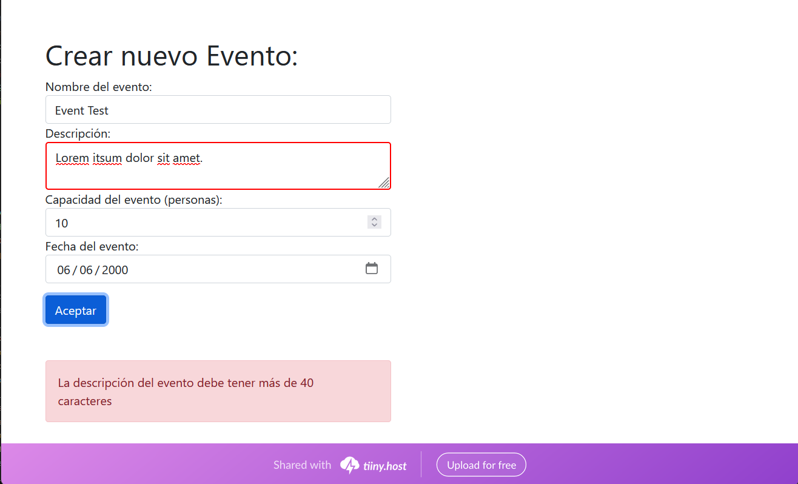
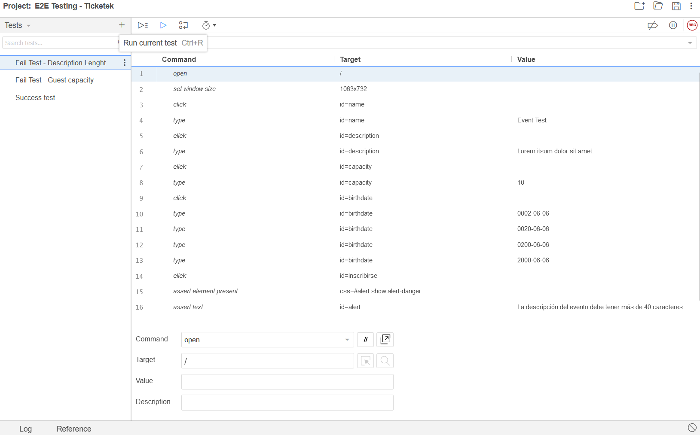
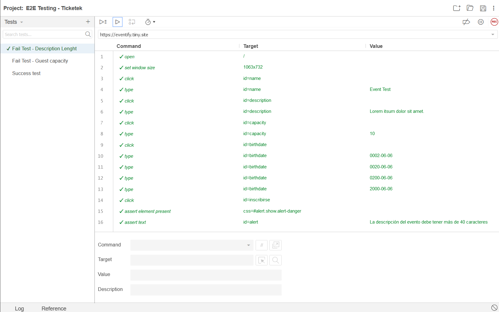
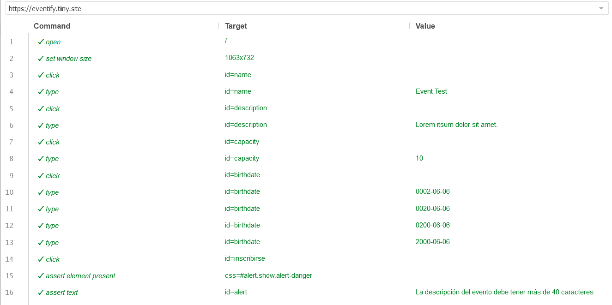
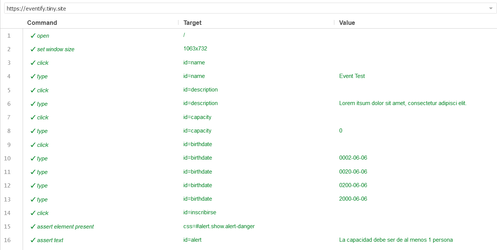
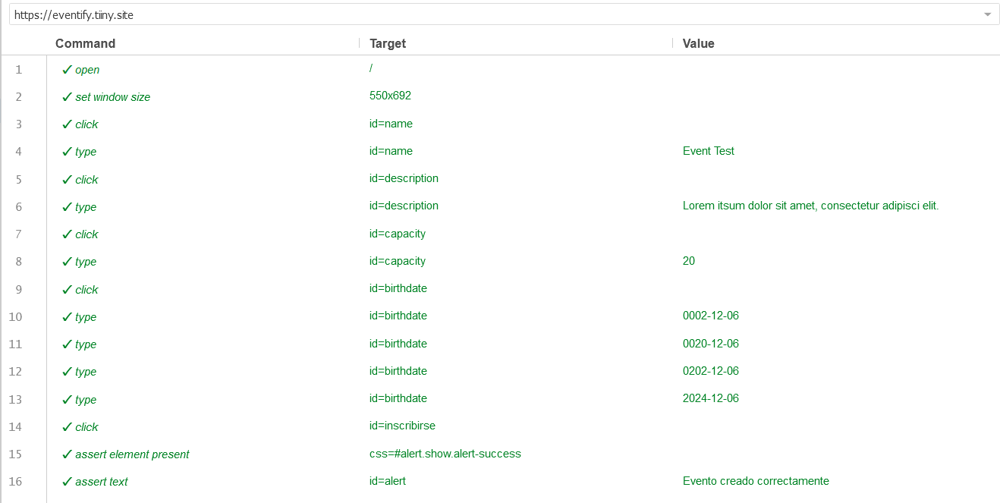

## Como realizar E2E Test con Selenium IDE
### Introducción
El siguiente documento tiene como objetivo explicar cómo realizar pruebas end-to-end (E2E) con Selenium IDE. Para ello, se explicará cómo instalar Selenium IDE, cómo grabar pruebas y cómo ejecutarlas.

### Instalación
Para instalar Selenium IDE, se debe seguir los siguientes pasos:
1. Ingresar a la página de [Selenium IDE](https://www.selenium.dev/selenium-ide/).
2. Descargar la extensión para el navegador que se esté utilizando.
3. Instalar la extensión.

### Grabación de pruebas
Para grabar pruebas con Selenium IDE, se debe seguir los siguientes pasos:
1. Abrir Selenium IDE.
2. Crear un nuevo proyecto.

3. Iniciar la grabación de un nuevo test.

    

4. Realizar las acciones que se desean grabar.

5. Detener la grabación.

### Ejecución de pruebas
Para ejecutar pruebas con Selenium IDE, se debe seguir los siguientes pasos:
1. Abrir Selenium IDE.
2. Abrir el test que se desea ejecutar.
3. Iniciar la ejecución del test.

4. Verificar los resultados de la ejecución.

---
### E2E Fail Test Lenght Description

### E2E Fail Test Event Capacity

### E2E Success Test

